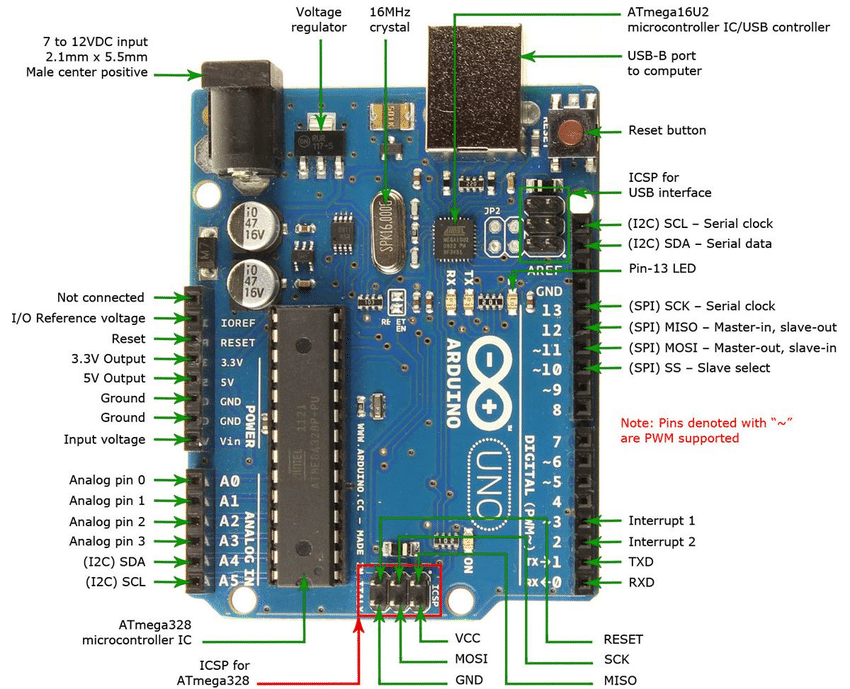
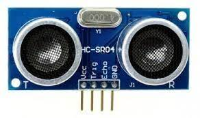
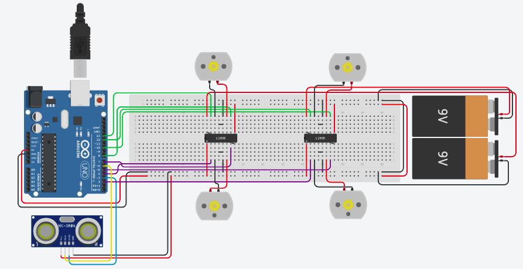
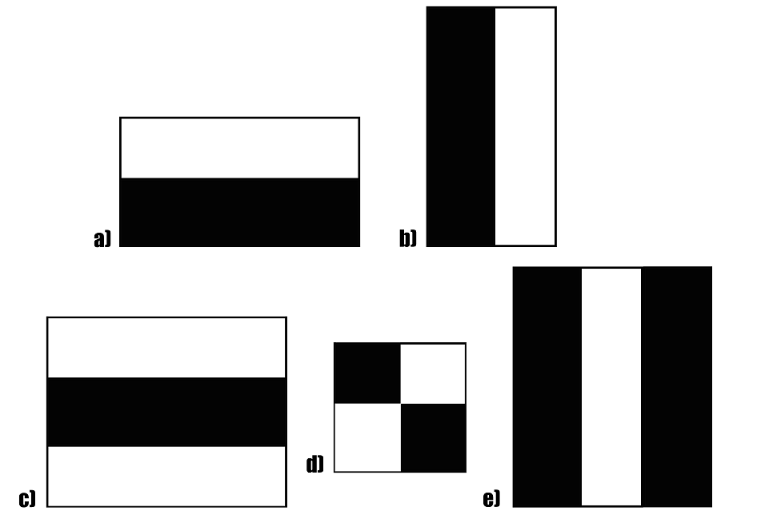

So let's start implementing the basic features in a humanoid.

We will implement the 3 most basic and important features in a humanoid:-

- Navigation
- Face detection
- Voice assistant

<br>

## **NAVIGATION**

```A humanoid is a non-human entity with human form and chareteristics.```

And one of the key features that humans or any animal can do is locomote. From ages and ages, organisms have been locomoting from one place to other in search of food and a safe place.

So how are we going to make our humanoid move autonomously?

Well the basic principle that we are going to apply for an autonomous movement is *moving up to a point by avoiding collision with obstacles on the way*

Since, detecting a point where it needs to go and then moving up to that point in an unknown environment requires higher-level concepts like **SLAM(Simultaneous Localization And Mapping)** to be integrated with the navigation system which is out of the scope of this workshop, what we are gonna do is that we are going to make a fully autonomous navigation system that will make our humanoid move on its own by avoiding obstacles in its path.

So without further ado, let's get going!

I hope y'all have your **tinkercad circuits** up and running. Create a new board and let's start collecting our components.

**Components**:-

- Arduino Uno - R3

  

  ```A microcontroller board based on the ATmega328P. It will be the brains of our navigation program.```

- L293D H-bridge motor driver

  

  ```The L293D is a dual-channel H-Bridge motor driver capable of driving a pair of DC motors```

- DC motor

  

  ```A class of rotary electrical motors that converts direct current electrical energy into mechanical energy```

- 9V batteries

  

  ```Will supply our bot with the power and current to locomote```

- Ultrasonic sensor

  

  ```The ultrasonic distance sensor sends out an ultrasonic sound wave from an emmitter. The sound waves bounce back when they hit an obstacle and are recieved by a reciever. Based on the distance, the sound wave travelled, we can calculate the distance of the obstacle from our bot.```

  ```Distance = (Time taken by the sound wave * speed of sound) / 2```

So now that we know about our components, let's assemble our circuit in tinkercad!



Now that we have assembled our circuit let's code our Arduino!

```c++

int trigger_pin = 6;
int echo_pin = 3;
int Rear_Left_Back=2;
int Rear_Left_Front=5;

int Rear_Right_Front=10;
int Rear_Right_Back=12;

int Front_Left_Back=4;
int Front_Left_Front=7;

int Front_Right_Front=8;
int Front_Right_Back=13;
int distance;

int time;

void setup()
{
  Serial.begin(9600);
  pinMode(trigger_pin, OUTPUT);
  pinMode(echo_pin, INPUT);
  
  pinMode(Rear_Left_Back, OUTPUT);
  pinMode(Rear_Left_Front, OUTPUT);
  pinMode(Rear_Right_Front, OUTPUT);
  pinMode(Rear_Right_Back, OUTPUT);
  
  pinMode(Front_Left_Back, OUTPUT);
  pinMode(Front_Left_Front, OUTPUT);
  pinMode(Front_Right_Front, OUTPUT);
  pinMode(Front_Right_Back, OUTPUT);
  
}

void loop(){
  
    digitalWrite (trigger_pin, HIGH);

    delayMicroseconds (10);

    digitalWrite (trigger_pin, LOW);

    time = pulseIn (echo_pin, HIGH);

    distance = (time * 0.034) / 2;
  
    if(distance >= 50){
      
          Serial.println("object not detected");
          Serial.print("Distance=");
          Serial.println(distance);
          digitalWrite(Rear_Left_Back,HIGH);
          digitalWrite(Rear_Left_Front,LOW);
          digitalWrite(Rear_Right_Front,HIGH);
          digitalWrite(Rear_Right_Back,LOW);
          
          digitalWrite(Front_Left_Back,HIGH);
          digitalWrite(Front_Left_Front,LOW);
          digitalWrite(Front_Right_Front,HIGH);
          digitalWrite(Front_Right_Back,LOW);
          
          delay(500);
    }
  
  else{
    
          Serial.println("object detected");
          Serial.print("Distance = ");
          Serial.println(distance);
    
          digitalWrite(Rear_Left_Back,LOW);
          digitalWrite(Rear_Left_Front,LOW);
          digitalWrite(Rear_Right_Front,LOW);
          digitalWrite(Rear_Right_Back,LOW);
          digitalWrite(Front_Left_Back,LOW);
          digitalWrite(Front_Left_Front,LOW);
          digitalWrite(Front_Right_Front,LOW);
          digitalWrite(Front_Right_Back,LOW);
    
          delay(500);
  }
}
```

There you go! We have implemented the very basic navigation system for our humanoid. Now our humanoid can move around autonomously without crashing into anything.

Now, we will have a 10 minutes break for you to clarify your doubts and then we will begin with face detection. Please ensure that you have Python and VSCode up and running perfectly:)

<br>

## **FACE DETECTION**

Hope y'all have your **VSCode** with **python** set-up and running.

First and foremost, we need to make a python *virtual environment*.

```Python applications use many different modules like OpenCV, flask and Tensorflow for extended and key functionalities that do not come pre-bundled inside the Python installation. That's why we need to download these packages using a package manager like pip. But, it often so happens that the dependency versions for one application does not suit that of the other and causes loads and loads of problems. That's where virtual environments come to our rescue. A virtual environment basically lets you isolate your project from your other projects in your system so that you don't have any dependency conflicts. It's highly recommended you always use a virtual environment for any python application you are making. ```

Make a new folder *Prismanoid* and open this folder in **VSCode**.

Open a new terminal from the toolbar.

We will be using the official Python package manager called **pip**

```bash
pip install virtualenv
virtualenv myenv
myenv/bin/activate (for windows and mac)
source myenv/bin/activate (for linux)
```

Now that our virtual environment is up and running, let's download the necessary dependancies.

We will only need 2 dependancies:-

- os

  ```This module provides functionalities to interact with our Operating system.```

  ```It comes pre-installed with Python```

- cv2

  ```cv2 is the Python package alias for OpenCV. A huge open-source library for computer vision, image processing and machine learning.```

  ```This is the module that will help us identify human faces. The library has become kinda the de-facto library for anything related to computer vision and image processing.```

  ```We can download it using:-```

  ```bash
  pip install opencv-python
  ```

It will take some time as it is a very large package so have some patience folks :)

Ok, so now that our dependencies have been installed, let's talk about how we will be going about making our program recognize human faces.

We will be using a pre-trained model from OpenCV's official repositories which is basically an **XML** file containing rules and instrunctions for how the model should work on a specific image or video.

The thing that the model uses is something known as **Haar-cascades**

```So what is Haar Cascade? It is an Object Detection Algorithm used to identify faces in an image or a real time video. The algorithm uses edge or line detection features proposed by Viola and Jones in their research paper “Rapid Object Detection using a Boosted Cascade of Simple Features” published in 2001. The algorithm is given a lot of positive images consisting of faces, and a lot of negative images not consisting of any face to train on them.``` 

So basically, by feeding lots and lots of images of labelled datatsets, i.e, images that contain faces and images that don't contain faces; and then making an algorithm extract the main differential features between the two types of images, we make the model able to differentiate between any further unlabelled images feeded into it to have a face or not.

what a haar cascade does if we talk about a high-level overview, is that it generates a haar feature.



These features on the image makes it easy to find out the edges or the lines in the image, or to pick areas where there is a sudden change in the intensities of the pixels.

```We make this haar feature traverse through the entire picture and extract the distinct edges and lines from it. The objective here is to find out the sum of all the image pixels lying in the darker area of the haar feature and the sum of all the image pixels lying in the lighter area of the haar feature.```

Naturally, all images with a face or faces will have somewhat similar edges and features and will be very distinct from images that won't have a face.

A very detailed explanation on what exactly happens in Haar-cascade is given here 👇🏻
https://towardsdatascience.com/face-detection-with-haar-cascade-727f68dafd08

As you may have guessed, for these kind of applications we need HUGE amounts of data... and am talking about datasets more than 5GBs or so, or else our model won't predict accurately.

```Remember: the more the data, the more accurate our model becomes```

But fortunately, OpenCV already has a trained model which we will be using.

Let's get into the code!

```python
# Import the necessary modules
import cv2 #OpenCV
import os  

# Define the file path for your model
cascPath=os.path.dirname(cv2.__file__)+"/model/haarcascade_frontalface_default.xml"
faceCascade = cv2.CascadeClassifier(cascPath)

# Start your webcam
video_capture = cv2.VideoCapture(0) 
# 0 is the key for default webcam. If you have an external camera then use 1 or 2

# Start a loop so that webcam remains on till you manually close it
while True:
    ret, frames = video_capture.read() # Capture individual frames
    
    # Convert normal image frame to GRAYSCALE for image processing
    gray = cv2.cvtColor(frames, cv2.COLOR_BGR2GRAY)
    
    
    faces = faceCascade.detectMultiScale(
        gray,
        scaleFactor=1.1, 
        '''Specifies how much the image size is reduced at each image.'''
        
        minNeighbors=5,
        '''Parameter specifying how many neighbors each candidate rectangle should have to retain it. This parameter will affect the quality of the detected faces. Higher value results in fewer detections but with higher quality. 3~6 is a good value for it.'''
        
        minSize=(30, 30),
        '''Minimum possible object size. Objects smaller than that are ignored.
This parameter determines how small size you want to detect. You decide it! Usually, [30, 30] is a good start for face detection.'''
        
        flags=cv2.CASCADE_SCALE_IMAGE)
    
    # Make the bounding box for detected face
    for (x, y, w, h) in faces:
        cv2.rectangle(frames, (x, y), (x+w, y+h), (0, 255, 0), 2)
        
    # Display the resulting frame
    cv2.imshow('Video', frames)
    
    # Stop webcam when the key 'q' is pressed
    if cv2.waitKey(1) & 0xFF == ord('q'):
        break
        
# Stop video feed and close all unnecessary windows        
video_capture.release()
cv2.destroyAllWindows()
```

So, now that we have implemented our face detection program, let's have a 10 minutes break before we move on to making our own virtual assistant! Till then, you may clarify your doubts :")

<br>

## **VIRTUAL ASSISTANT**

The most distinct feature of a humanoid is that it behaves somewhat like a human and what better way is there to show something to be similar to humans than being able to talk and speak in an intelligent way.

We all have interacted with virtual assitants like Google assistant, Amazon Echo, Microsoft Cortana. etc., so let's dive right in to making one basic virtual assistant of our own that can tell us the weather, open up YouTube, Chrome, Gmail, tell us jokes, fetch us news articles and even search up basic definitions from Wikipedia!

I hope you all have your virtual environments up and activated because for this application we will need to download a bunch of modules :P 

It's a fairly large code so I'll be copy pasting from the github repo and I hope y'all can access it :)

The following command will download all the required libraries and while it takes some time let me explain what each library does

```python
pip install pyttsx3 wikipedia SpeechRecognition pyjokes requests beautifulsoup4
```

The modules we will need:-

- Pyttsx3

  ```This module is used for the conversion of text to speech. ```

- Wikipedia

  ```Using this module we can search things from Wikipedia```

- Speech Recognition

  ```Since we’re building an Application of voice assistant, one of the most important things in this is that your assistant recognizes your voice (means what you want to say/ ask)```

- Web browser

  ```To perform a web search```

- Pyjokes

  ```Pyjokes is used for collection Python Jokes over the Internet```

- Requests

  ```Used for making GET and POST requests.```

  ```We will use this in fetching weather data```

- BeautifulSoup

  ```Library that makes it easy to scrape information from web pages```

Now that we know what modules we are using let's jump into the code!

```python
# Importing all the necessary libraries
import speech_recognition as sr
import pyttsx3
import datetime
import wikipedia
import webbrowser
import time
import requests


print('Loading your personal humanoid - Prisma')

# Initiate the voice engine using pyttsx3
engine=pyttsx3.init() 

'''engine=pyttsx3.init()
   - For MAC and Linux, as 'sapi5' is the default voice engine for Microsoft windows.
   - For linux, you also need to install libespeak using-
     sudo apt-get install libespeak (Example for Debian distros)
'''

voices=engine.getProperty('voices')
engine.setProperty('voice',voices[0].id) # 0 for male, 1 for female


def speak(text):
    '''Speaks the string given as the parameter'''
    engine.say(text)
    engine.runAndWait()

def wishMe():
    '''greetings based on the time of the day'''
    hour=datetime.datetime.now().hour
    if hour>=0 and hour<12:
        speak("Hello,Good Morning")
        print("Hello,Good Morning")
    elif hour>=12 and hour<18:
        speak("Hello,Good Afternoon")
        print("Hello,Good Afternoon")
    else:
        speak("Hello,Good Evening")
        print("Hello,Good Evening")

        
def takeCommand():
    '''Defines the input (microphone)'''
    r=sr.Recognizer()
    with sr.Microphone() as source:
        r.adjust_for_ambient_noise(source)
        print("Listening...")
        audio=r.listen(source)

        try:
            statement=r.recognize_google(audio,language='en-in') # Convert speech to text
            print(f"User said: {statement}\n")

        except Exception as e:
            speak("Pardon me, please say that again")
            return "None"
        return statement

speak("Loading your personal humanoid Prisma")
wishMe()

# Main program
if __name__=='__main__':

    # Loop to keep the assistant on
    while True:
        speak("Tell me how can I help you now?")
        statement = takeCommand().lower() # Take command
        if statement==0:
            continue 

        if "goodbye" in statement or "ok bye" in statement or "stop" in statement:
            speak('your personal humanoid Prisma is shutting down, Good bye')
            print('your personal humanoid is shutting down, Good bye')
            break

        if 'wikipedia' in statement:
            speak('Searching Wikipedia...')
            statement =statement.replace("wikipedia", "")
            results = wikipedia.summary(statement, sentences=3)
            speak("According to Wikipedia")
            print(results)
            speak(results)

        elif 'open youtube' in statement:
            webbrowser.open_new_tab("https://www.youtube.com")
            speak("youtube is open now")
            time.sleep(5)

        elif 'open google' in statement:
            webbrowser.open_new_tab("https://www.google.com")
            speak("Google chrome is open now")
            time.sleep(5)

        elif 'open gmail' in statement:
            webbrowser.open_new_tab("https://www.gmail.com")
            speak("Google Mail open now")
            time.sleep(5)

        elif "weather" in statement:
            api_key="8ef61edcf1c576d65d836254e11ea420"
            base_url="https://api.openweathermap.org/data/2.5/weather?"
            speak("What's the city name")
            city_name=takeCommand()
            complete_url=base_url+"appid="+api_key+"&q="+city_name
            response = requests.get(complete_url)
            x=response.json()
            if x["cod"]!="404":
                y=x["main"]
                current_temperature = y["temp"] - 273
                current_humidity = y["humidity"]
                z = x["weather"]
                weather_description = z[0]["description"]
                speak(" Temperature is " +
                      str(current_temperature) + " degrees celsius" +
                      "\n The humidity is " +
                      str(current_humidity) + " percentage"
                      "\n description  " +
                      str(weather_description))
                print(" Temperature in celsius unit = " +
                      str(current_temperature) +
                      "\n humidity (in percentage) = " +
                      str(current_humidity) +
                      "\n description = " +
                      str(weather_description))

            else:
                speak(" City Not Found ")

        elif 'time' in statement:
            strTime=datetime.datetime.now().strftime("%H:%M:%S")
            speak(f"the time is {strTime}")

        elif 'who are you' in statement or 'what can you do' in statement:
            speak('I am Prisma version 1, your persoanl humanoid. I am programmed to do minor tasks like'
                  'opening youtube,google chrome,gmail and stackoverflow ,predict time,search wikipedia,predict weather' 
                  'in different cities , get top headline news from times of india and much much more!')


        elif "who made you" in statement or "who created you" in statement or "who discovered you" in statement:
            speak("I was built by HumanoidX")
            print("I was built by HumanoidX")

        elif "open stackoverflow" in statement:
            webbrowser.open_new_tab("https://stackoverflow.com/login")
            speak("Here is stackoverflow")

        elif 'news' in statement:
            news = webbrowser.open_new_tab("https://timesofindia.indiatimes.com/home/headlines")
            speak('Here are some headlines from the Times of India,Happy reading')
            time.sleep(6)

        elif 'search'  in statement:
            statement = statement.replace("search", "")
            webbrowser.open_new_tab(statement)
            time.sleep(5)

time.sleep(3)
```

So there you go! We have given our humanoid the ability to understand us on a very very basic level and do some tasks based on our instructions. You can add uncountable number of further features using the thousands of python libraries that are available on the net and hundreds of APIs to integrate some very advanced features like make calls/ send sms, compute mathematical and geographical questions, sing a song for you and even take a selfie and shut down your computer for you!

So, that's it for this workshop! We obviously haven't shown you how to make your own body, but have some patience for **Prismanoid v2.0** where we gonna explain how you can design the body of a full-fledged humanoid!
Stay tuned to our instagram channel for more awesome workshops like this one and till then, stay safe and keep innovating!
<br>
## 🔗 Links

[](https://humanoidxvitcc.in)
[](https://www.instagram.com/humanoidx.vitcc/)
[](https://www.linkedin.com/company/humanoidxvitcc/mycompany/)